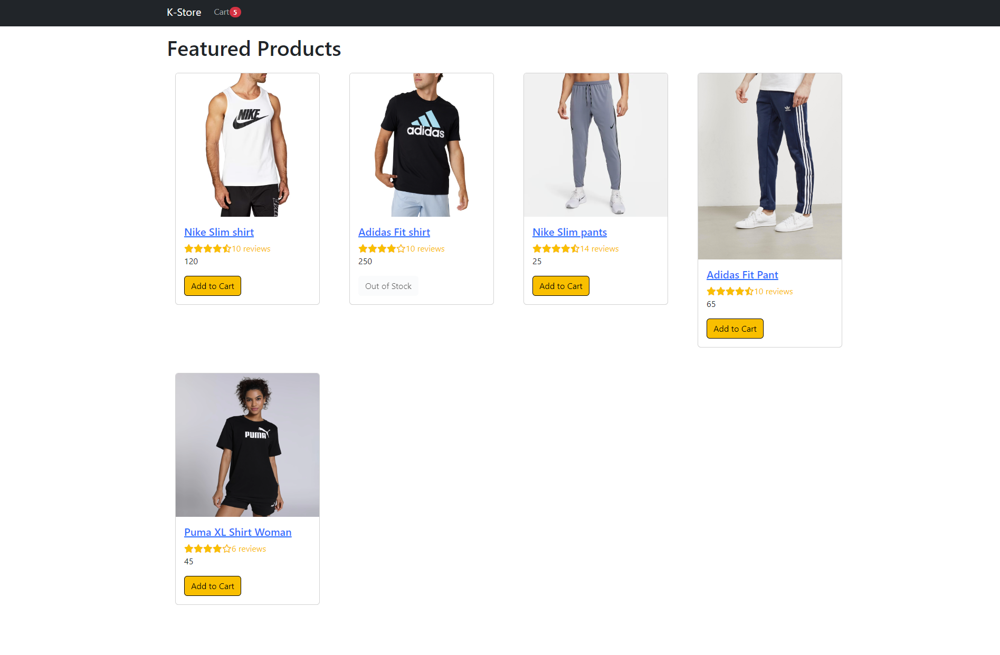
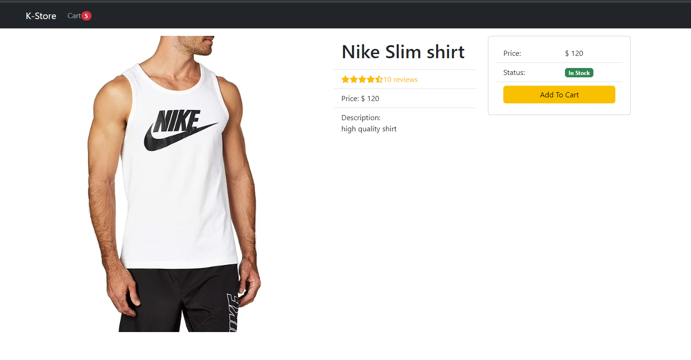
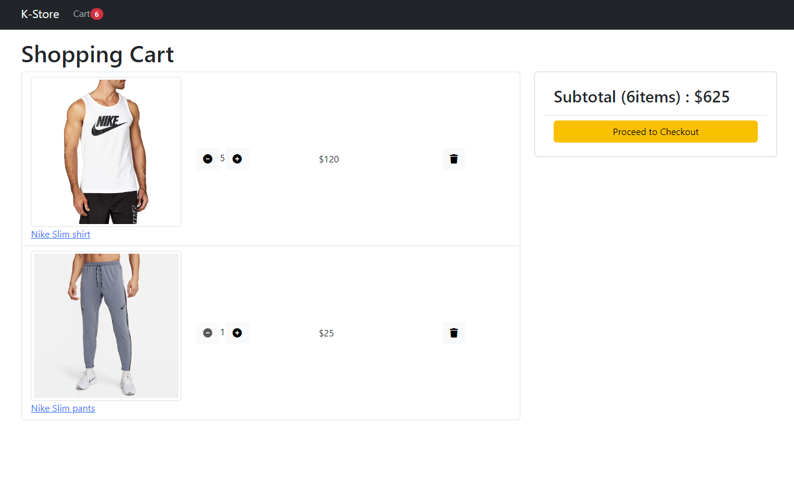
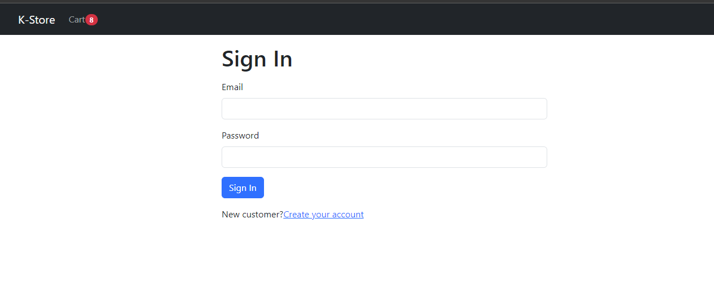

# MERN K-STORE

### a React ecommerce site

Its made using MERN (Mongo - Express.js - React - Node.js) - (**_I'm currently working on finish this project_**)

### Pre-requisites:

**_- Node.js_**

**_- Docker (just if you choose to use Dockerized MongoDB)_**

---

### Stack used:

### Frontend:

**_- Javascript_**

**_- React_**

**_- React router dom 6_**

**_- React context API_**

**_- Axios for promise based HTTP client_**

**_- react-bootstrap_**

**_- react-helmet_**

**_- font-awesome_**

---

### Backend:

**_- MongoDB for database for persistence_**

**_- Express.js server_**

---

### Current features:

**_-Featured products view_**

**_-Product view_**

**_-Cart_**

- view cart
- add items to cart
- remove items from cart

**_-Data retrieved from Mongo_**

---

### Create your own .env file for database credentials

- Create a .env file inside backend
- Create a MONGODB*URI for mongo's connection string, you can create an online mongo db at atlas or using a local version or dockerized one (docker-compose.yml already provided at backend folder just use command -> \*\*\_docker-compose up -d*\*\*).

- .env-example is provided in the code repo

---

### Steps to install:

1.  git clone

2.  cd k-store

3.  cd backend

4.  npm i

5.  npm run start

6.  Using another console -> cd frontend

7.  npm i

8.  npm run start

9.  Open in browser http://localhost:3000

---

### SCREENSHOTS

Featured products

Product view

Cart view

Sign In

